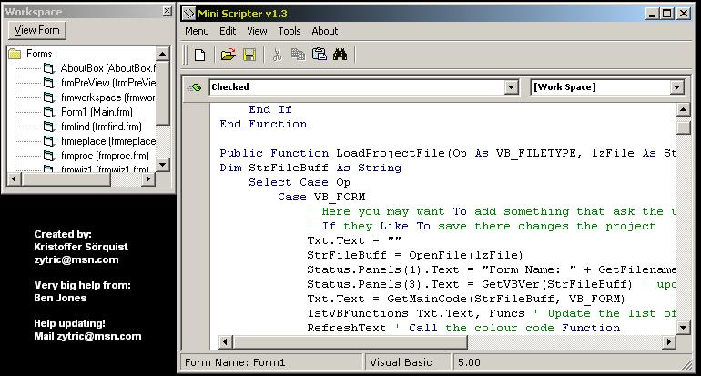



## Mini Scripter v1\.3

### Description

Here it is again! With this mini scripter you can code your vb code without vb. This is just a BETA and please read the about form in 'Mini Scriper'.
 
### More Info
 

             |
---                |---
**Submitted On**   |2003-04-17 23:20:46
**By**             |[Kristoffer\.\.\.](https://github.com/Planet-Source-Code/PSCIndex/blob/master/ByAuthor/kristoffer.md)
**Level**          |Intermediate
**User Rating**    |4.2 (21 globes from 5 users)
**Compatibility**  |VB 3\.0, VB 4\.0 \(16\-bit\), VB 4\.0 \(32\-bit\), VB 5\.0, VB 6\.0, VB Script, ASP \(Active Server Pages\) , VBA MS Access, VBA MS Excel
**Category**       |[Complete Applications](https://github.com/Planet-Source-Code/PSCIndex/blob/master/ByCategory/complete-applications__1-27.md)
**World**          |[Visual Basic](https://github.com/Planet-Source-Code/PSCIndex/blob/master/ByWorld/visual-basic.md)
**Archive File**   |[Mini\_Scrip1575504182003\.zip](https://github.com/Planet-Source-Code/kristoffer-mini-scripter-v1-3__1-44828/archive/master.zip)

